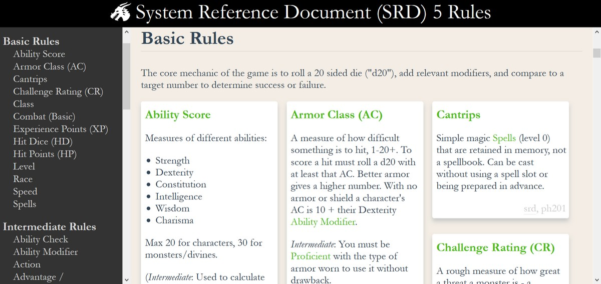

# System Reference Document (SRD) 5 Rules

This is an unofficial summary of the SRD5 rules, starting with the most basic and moving to more complex rules. 

See https://dnd-pub.web.app/

## Goals

- Make a compact and printable summary of the rules
- Organize rules into basic, intermediate, and complex to aid in learning

## Contribute

To update the rules, you can <a href="https://github.com/bburns/dnd-rules/edit/master/rules/rules.nm">edit the rules directly</a>. I'd like to keep the rules compact so they can be printed easily. See below for an explanation of the format.

To file an issue, see the <a href="https://github.com/bburns/dnd-rules/issues">Issues page</a>.

Or send an email to <a href="mailto:brian@dnd.pub">brian@dnd.pub</a>.

## Rule Format

The rules are located in `rules/rules.nm` - the rule name is offset by dashes, the rule contents are Markdown, with Wiki-like internal links to other rules, and properties marked with a hat (^), e.g. 

        ---------------------------------------------------------------------------
        # Ability Score #
        ---------------------------------------------------------------------------

        Measures of different abilities: 

        * Strength
        * Dexterity
        * Constitution
        * Intelligence
        * Wisdom
        * Charisma

        Max 20 for characters, 30 for monsters/divines. 

        (*Intermediate*: Used to calculate [[Ability Modifier|Ability Modifiers]]. Each has associated [[Skill|Skills]], e.g. Strength has Athletics.)

        ^type: rule
        ^ref: ph12,173
        ^phase: character
        ^complexity: basic

## About

The site itself is made with React, with <a href="https://github.com/desandro/colcade">Colcade</a> to fit the rules into tiles, and <a href="https://github.com/remarkjs/remark">Remark</a> to convert Markdown to HTML. 

The rules are converted to JSON with <a href="https://github.com/bburns/dnd-rules/blob/master/scripts/nm2json.js">nm2json.js</a>, which is then bundled into the final site. "nm" is for Neomem, which is another project I'm working on. 

## Setup

Install [git](https://git-scm.com/downloads) and [yarn](https://yarnpkg.com/getting-started/install).

Clone this repository with git - 

    git clone https://github.com/bburns/dnd-rules.git

then grab the dependencies with yarn

    cd dnd-rules
    yarn

## Develop

Run the app in the development mode - 

    yarn start

It will open [http://localhost:3000](http://localhost:3000) in the browser - the page will reload as you make edits, including to the rules file.

## Print

Print the site to a pdf using Microsoft Edge and add it to the `public/pdf` folder, then update the link in `src/components/app/index.jsx`.

I've tried printing the site with Firefox, Chrome, and Microsoft Edge, all on Windows - Edge is the only one that works well - Firefox only prints one page, and Chrome doesn't do the page breaks. 

So until I'm able to fix those issues (if ever?) I'll print the site to a pdf after changes made to the rules, using Edge. 

## Deploy

Deploy the site to the Firebase Hosting page, https://dnd-pub.web.app/. This will also run the build step (yarn run build). 

    yarn deploy

## License

This site is GPL. The rule contents are OGL (Open Game License) - see <a href="https://raw.githubusercontent.com/bburns/dnd-rules/master/OGL">here</a>.
